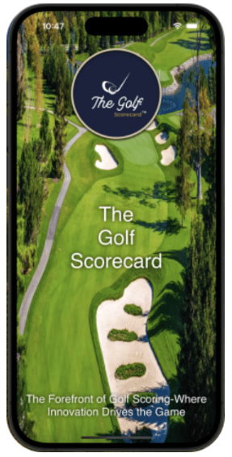
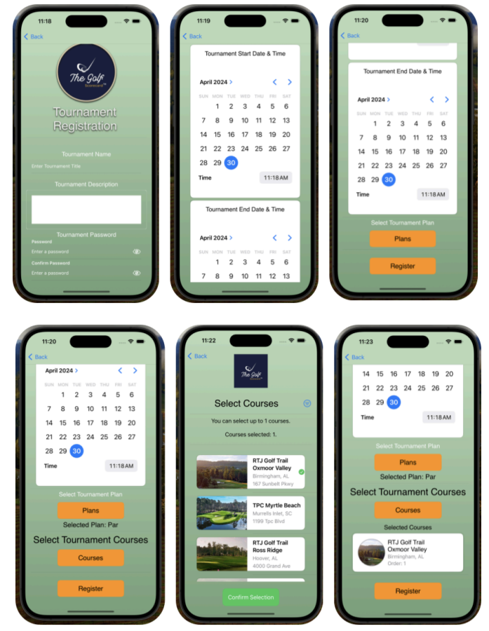

# ⛳ The Golf Scorecard App

A full-stack iOS application to track golf scores, player stats, and round history. Designed and deployed under an agile workflow, this project earned **3rd Place in the NJIT Capstone Showcase**.
As the project was hosted on a university managed repository, I no longer retain direct access to the source code following the conclusion of the semester.

🏆 **Award:**  
[Click here to view certificate](certificate.png)

---

## 🖼️ Screenshots

### Home Page  

### UI Preview  

